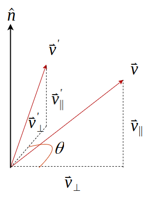
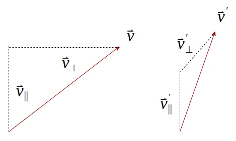
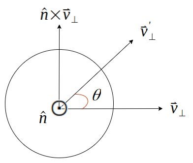

# Rodrigues' Rotation Formula
羅德里格旋轉公式是計算三維空間中，一個向量繞著旋轉軸旋轉並且給定旋轉角度後可以得到新向量的計算公式。

$$
\begin{align*}
{\vec{v}} = \vec{v}_{\parallel} + \vec{v}_{\perp} \\
{\vec{v}}^{\prime} = {\vec{v}_{\parallel}}^{\prime} + {\vec{v}_{\perp}}^{\prime}
\end{align*}
$$

<!-- $$
\begin{aligned}
{\vec{v}} = \vec{v}_{\parallel} + \vec{v}_{\perp} \\
{\vec{v}}^{\prime} = {\vec{v}_{\parallel}}^{\prime} + {\vec{v}_{\perp}}^{\prime}
\end{aligned}
$$ -->

<!-- 

向量 $\vec{v}$ 的分量 $\vec{v}_{\parallel}$ 是投影在旋轉軸 $\hat n$ 上的向量，在旋轉的時候不會受到變化，所以

$$
\vec{v}_{\parallel} = {\vec{v}_{\parallel}}^{\prime}
$$

事實上，當向量 $\vec v$ 繞著旋轉軸旋轉時，只有 $\vec{v}_{\perp}$ 跟著旋轉

所以只要算出 ${\vec{v}_{\perp}}^{\prime}$ 就能得到 ${\vec{v}}^{\prime}$

$$
\begin{align*}
{\vec{v}}^{\prime} &= {\vec{v}_{\parallel}}^{\prime} + {\vec{v}_{\perp}}^{\prime} \\
{\vec{v}}^{\prime} &= {\vec{v}_{\parallel}} + {\vec{v}_{\perp}}^{\prime} 
\end{align*}
$$

$$
\begin{align*}
{\vec{v}_{\perp}}^{\prime} &= {\vec{v}_{\perp}}{\cos(\theta)} + {{{\hat n} \times {\vec{v}}} \over |{\vec {v}}|}
|{\vec {v}}|\sin(\theta) \\
&= {\vec{v}_{\perp}}{\cos(\theta)} + ({\hat n} \times {\vec{v}})\sin(\theta)
\end{align*}
$$

$$
\begin{align*}
{\vec{v}}^{\prime} &= {\vec{v}_{\parallel}} + {\vec{v}_{\perp}}{\cos(\theta)} + ({\hat n} \times {\vec{v}})\sin(\theta) \\
&= {\vec{v}_{\parallel}} + (\vec{v} - {\vec{v}_{\parallel}})\cos(\theta) + ({\hat n} \times {\vec{v}})\sin(\theta) \\
&= {\vec{v}_{\parallel}}(1 - \cos(\theta)) + \vec{v}\cos(\theta) + ({\hat n} \times {\vec{v}})\sin(\theta) \\
&= (\hat{n} \cdot \vec{v})\vec{v}(1 - \cos(\theta)) + \vec{v}\cos(\theta) + ({\hat n} \times {\vec{v}})\sin(\theta) 
\end{align*}
$$

the Rodrigues formula for the rotated vector $\vec{v}^{\prime}$ is 

$$
{\vec{v}}^{\prime}= (\hat{n} \cdot \vec{v})\vec{v}(1 - \cos(\theta)) + \vec{v}\cos(\theta) + ({\hat n} \times {\vec{v}})\sin(\theta) 
$$
 -->
