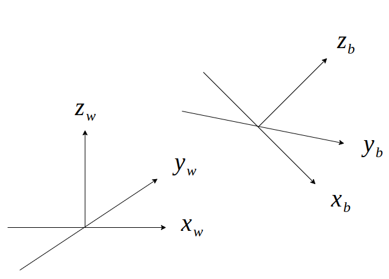
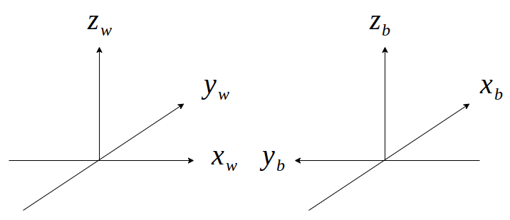
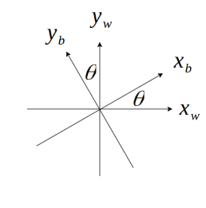
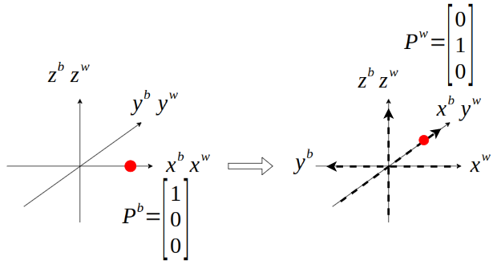
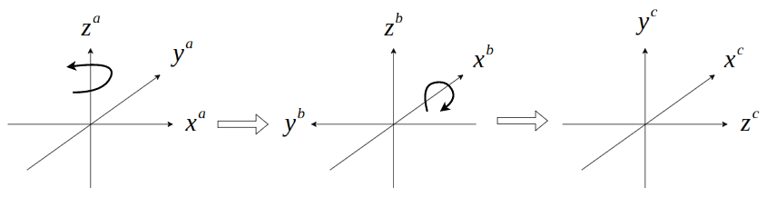

# Rotation Matrix
## 旋轉矩陣的意義
旋轉矩陣為一種兩個座標系的相對位置的敘述方法，例如要描述body-frame(簡稱w-frame)對於world frame(簡稱w-frame)的旋轉矩陣為

$$
R^w_b = 
\begin{bmatrix}
x^w_b & y^w_b & z^w_b  
\end{bmatrix}
$$

$R^w_b$為b-frame相對於w-frame的旋轉矩陣， $x^w_b$ 、 $y^w_b$ 、 $z^w_b$ 則是代表
$x_b$ 、 $y_b$ 、 $z_b$ 在w-frame中的表示方法



假設原本b-frame和w-frame重合，b-frame繞著z軸旋轉90度，此時兩者的相對位置為



那麼敘述兩者之間的旋轉矩陣為

$$
R^w_b = 
\begin{bmatrix}
x^w_b & y^w_b & z^w_b  
\end{bmatrix} = \begin{bmatrix}
0 & -1 & 0 \\
1 &  0 & 0 \\
0 &  0 & 1
\end{bmatrix}
$$

$R^w_b$ 當中的上標代表參考座標系(reference frame)，而下標代表目標座標系(target frame)，意思是指目標座標系在參考座標系中的相對位置

如果由z軸朝下看x-y平面的話，繞著z軸的轉動可以寫成



$$
R^w_b(\theta = 90) = 
\begin{bmatrix}
x^w_b & y^w_b & z^w_b  
\end{bmatrix} = \begin{bmatrix}
\cos\theta & -\sin\theta & 0 \\
\sin\theta &  \cos\theta & 0 \\
0 &  0 & 1
\end{bmatrix}
$$

此時Euler Angles的概念就出現了，Euler Angles是來描述相對於x、y、z軸旋轉的旋轉矩陣，
並且經由一定的順序來描述各種旋轉，最常見的為z-y-x

## 點在空間中的轉動
如何使用旋轉矩陣來描述點在空間中的轉動，此時一開始b-frame跟w-frame重合。
在b-frame上有個點 $P^b$ ，若b-frame繞著z軸旋轉90度，則 $P^b$ 在w-frame當中為



如上圖所示，當b-frame旋轉時，b-frame上的 $P^b$ 也會跟著旋轉(與b-frame相對位置不變)，
此時旋轉後的結果就是 $P^b$ 在w-frame上的位置，經旋轉矩陣可以計算出
$P^b$ 旋轉後在w-frame上的結果為
```math
\begin{bmatrix}
0 \\ 1 \\ 0
\end{bmatrix} 
= \begin{bmatrix}
\cos90\degree & -\sin90\degree & 0 \\
\sin90\degree &  \cos90\degree & 0 \\
0 &  0 & 1
\end{bmatrix}
\begin{bmatrix}
1 \\ 0 \\ 0
\end{bmatrix} = \begin{bmatrix}
0 & -1 & 0 \\
1 &  0 & 0 \\
0 &  0 & 1
\end{bmatrix}
\begin{bmatrix}
1 \\ 0 \\ 0
\end{bmatrix}
```
運算得到的結果稱為 $P^w$ 是以w-frame為參考座標系

```math
P^w = R^w_b P^b
```

此運算式可以解釋成在b-frame上的 $P^b$ 隨著b-frame轉動後，在w-frame上看 $P^b$
的結果

## pre-multiplication and post-multiplication 
如果對一個旋轉矩陣後乘或是前乘另外一個旋轉矩陣將會有不同的結果

- pre-multiplication
rotation about the current axis



從 \{a\} 沿著 $z^a$ 轉動至 \{b\} 此時下一個轉動是沿著當下的 \{b\} 去旋轉
所以後乘上 {c} 相對於 {b} 的 $R^b_c$

```math
R^a_b R^b_c
```

- post-multiplication


### reference:
[pdf](pdf/postmultiply.pdf)